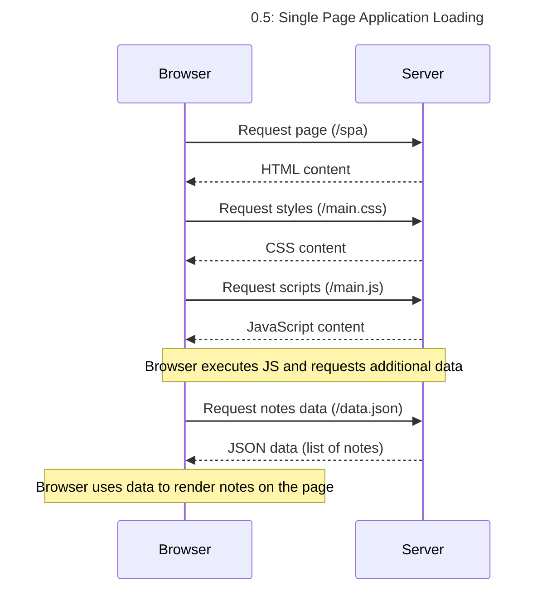

```mermaid
sequenceDiagram
    Title: 0.5: Single Page Application Loading

    participant User as Browser
    participant Backend as Server

    User->>Backend: Request page (/spa)
    Backend-->>User: HTML content
    User->>Backend: Request styles (/main.css)
    Backend-->>User: CSS content
    User->>Backend: Request scripts (/main.js)
    Backend-->>User: JavaScript content

    note over User,Backend: Browser executes JS and requests additional data

    User->>Backend: Request notes data (/data.json)
    Backend-->>User: JSON data (list of notes)

    note over User: Browser uses data to render notes on the page
```